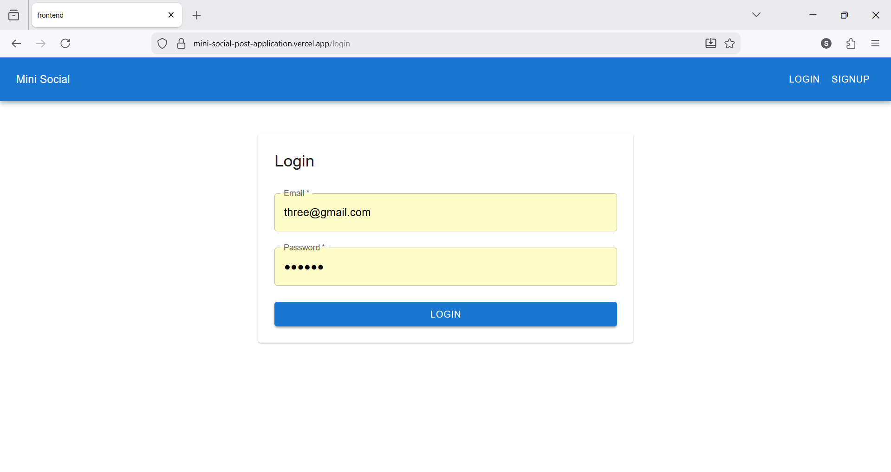
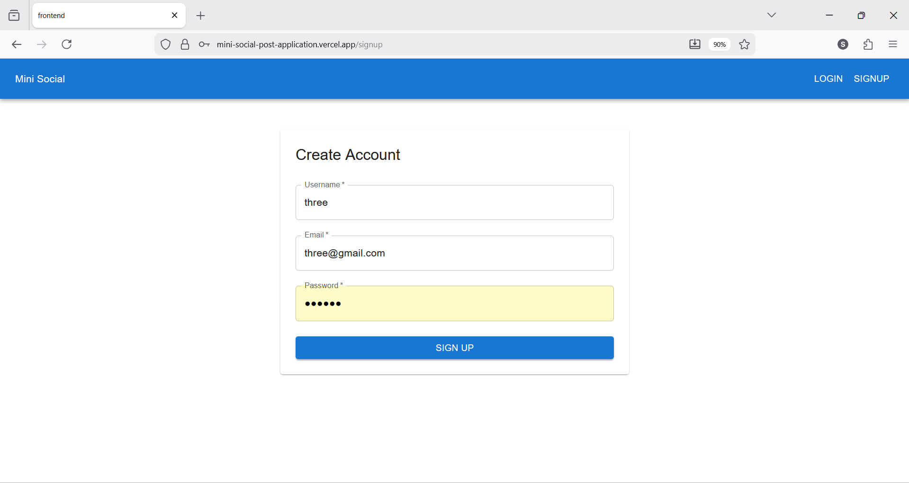
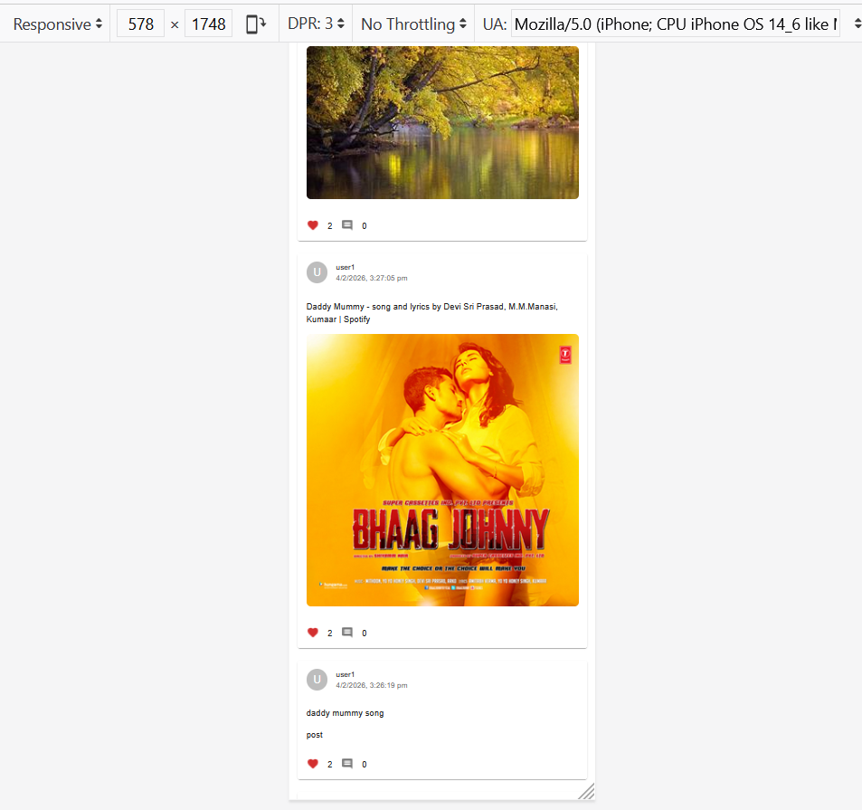
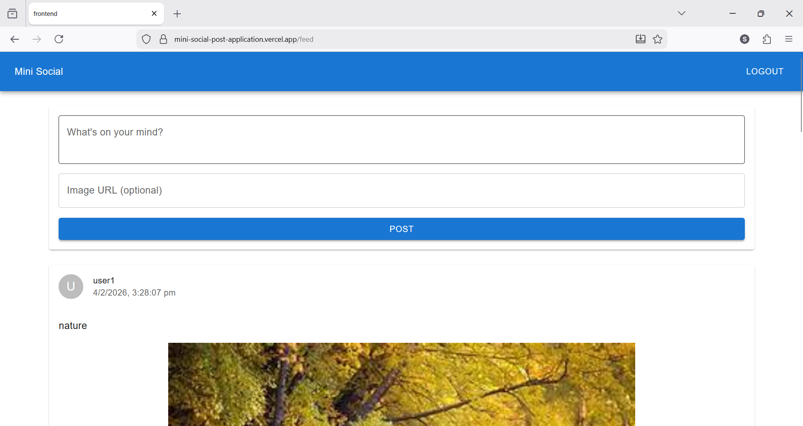

# 🚀 Mini Social Post Application (3W Full Stack Internship Task)

A full-stack **Mini Social Media Application** built as part of the **3W Business Private Limited – Full Stack Internship** assignment.
This project allows users to create accounts, post content, like and comment on posts, and view a public feed — inspired by the **TaskPlanet Social Page**.

---

## 🌐 Live Demo

🔗 **Frontend (Vercel)**
[https://mini-social-post-application.vercel.app](https://mini-social-post-application.vercel.app)

🔗 **Backend API (Render)**
[https://mini-social-post-application-x0vv.onrender.com](https://mini-social-post-application-x0vv.onrender.com)

---

## 📌 Features Implemented

### 🔐 Authentication

* User **Signup & Login** with email and password
* Password hashing using **bcrypt**
* JWT-based authentication
* Protected routes for creating posts, liking & commenting

### 📝 Posts

* Create a post with:

  * Text only
  * Image only
  * Text + Image
* Public feed showing all posts
* Posts displayed in **original image size on desktop screens**

### ❤️ Like & 💬 Comment

* Like any post
* Comment on any post
* Real-time UI updates (no page reload)
* Stores usernames of users who liked/commented

### 📰 Feed

* Displays:

  * Username
  * Post content (text/image)
  * Total likes
  * Total comments
* Clean, modern, responsive UI inspired by TaskPlanet

---

## 🛠 Tech Stack

### Frontend

* **React.js (Vite)**
* **Material UI (MUI)**
* Fetch API 
* React Context API for authentication
* Fully responsive design

### Backend

* **Node.js**
* **Express.js**
* **MongoDB + Mongoose**
* JWT Authentication
* Secure CORS handling (supports Vercel preview & production domains)

### Database

* **MongoDB Atlas**
* Only **two collections** used:

  * `users`
  * `posts`

### Deployment

| Layer    | Platform      |
| -------- | ------------- |
| Frontend | Vercel        |
| Backend  | Render        |
| Database | MongoDB Atlas |

---

## 🧱 Project Structure

### Backend

```
backend/
│── config/
│   └── db.js
│── controllers/
│   ├── auth.controller.js
│   └── post.controller.js
│── models/
│   ├── User.js
│   └── Post.js
│── routes/
│   ├── auth.routes.js
│   └── post.routes.js
│── middleware/
│   └── auth.middleware.js
│── server.js
│── .env
```

### Frontend

```
frontend/
│── src/
│   ├── api/
│   │   └── api.js
│   ├── components/
│   │   ├── Navbar.jsx
│   │   ├── PostCard.jsx
│   │   └── CreatePost.jsx
│   ├── pages/
│   │   ├── Login.jsx
│   │   ├── Signup.jsx
│   │   └── Feed.jsx
│   ├── contexts/
│   │   └── AuthContext.jsx
│   ├── App.jsx
│   └── main.jsx
```

---

## 🧪 API Endpoints

### Auth

| Method | Endpoint           | Description       |
| ------ | ------------------ | ----------------- |
| POST   | `/api/auth/signup` | Register new user |
| POST   | `/api/auth/login`  | Login user        |

### Posts

| Method | Endpoint                 | Description     |
| ------ | ------------------------ | --------------- |
| POST   | `/api/posts`             | Create post     |
| GET    | `/api/posts`             | Get all posts   |
| POST   | `/api/posts/:id/like`    | Like post       |
| POST   | `/api/posts/:id/comment` | Comment on post |

---

## 🖼 Screenshots

> 📌 Add screenshots in a `/screenshots` folder and update image paths below

### 🔐 Login Page



### 📝 Signup Page



### 📰 Feed Page



### ✍️ Create Post



---

## 🏆 Bonus Points Covered

✅ Clean and modern UI
✅ Fully responsive layout
✅ Secure authentication flow
✅ Optimized API structure
✅ Proper error handling (UI + backend)
✅ Industry-standard deployment
✅ Well-structured, reusable code

---

## ⚙️ How to Run Locally

### Backend

```bash
cd backend
npm install
npm run dev
```

### Frontend

```bash
cd frontend
npm install
npm run dev
```

---

## 📄 Notes for Evaluators

* Project strictly follows the assignment constraints
* Uses only **two MongoDB collections**
* UI inspired by **TaskPlanet Social Page**
* TailwindCSS not used (as instructed)
* Fetch API used instead of Axios
* Production-ready CORS handling implemented

---

## 🙌 Author

**Sufal Thakre**
Full Stack Developer (MERN)

---

⭐ If you like this project, feel free to star the repository!
